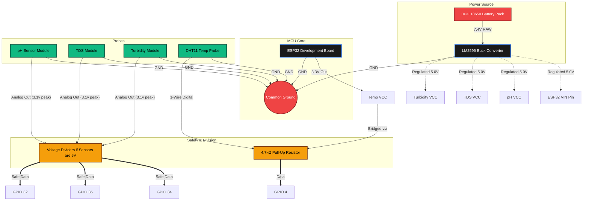

# Hardware Setup Guide (Dual-Node Architecture)

## 1. Sensor Node (ESP32 #1)
Monitors water quality and transmits data to the server. The ESP32 is a 3.3V logic device. **Do not apply 5V directly to the GPIO pins without voltage division or logic level conversion, or the ESP32 will permanently fail.**

### Power Requirements
- **Microcontroller**: The ESP32 requires a 5V input either via the Micro-USB port or specifically pin `VIN`. 
- **Mobile Power**: If deployed on the actual "Jellyfish", you should use `2x 18650 Li-ion` cells (in series for 7.4V or parallel for 3.7V). Provide a **buck converter (e.g., LM2596)** to strictly step the voltage down to 5.0V before entering the ESP32 `VIN` pin. 
- **Sensor Power**: Most commercial analog water sensors (pH, TDS, Turbidity) operate at 3.3V - 5.0V. It's recommended to pull their `VCC` from the stepped-down 5V line rather than relying on the ESP32's onboard 3.3V regulator, which may overheat if current draw exceeds ~200mA.

### Circuit Protective Measures
The pH, TDS, and Turbidity sensor probes output analog voltages. **If your sensor boards transmit a 5V peak analog signal**, you MUST use a voltage divider (e.g., a simple resistor network using `R1=2kΩ` and `R2=3.3kΩ`) between the sensor's `A0` output and the ESP32 `GPIO` to safely step the 5V max signal down to approximately 3.1V max.

### Wiring
| Sensor        | ESP32 Pin | Power | Ground |
|---------------|-----------|-------|--------|
| pH            | GPIO 34   | `5V OUT` (Stepped Down)  | `GND`    |
| TDS           | GPIO 35   | `5V OUT` (Stepped Down)  | `GND`    |
| Turbidity     | GPIO 32   | `5V OUT` (Stepped Down)  | `GND`    |
| DHT11 (Temp)  | GPIO 4    | 3.3V  | `GND`    |

*Critical Note: If using a bare `DHT11` sensor (not a pre-mounted module board), it strictly requires a `4.7kΩ` to `10kΩ` pull-up resistor bridging its `Data` (GPIO 4) and `VCC` (3.3V) lines.*

---

## 2. Actuator Node (ESP32 #2)
Receives commands from the Decision Engine and activates massive industrial relays to control physical treatment systems.

### Relay Electrical Safety (CRITICAL)
**DO NOT run the water pumps or UV lights directly from the ESP32 GPIOs or Power lines.** Microcontrollers output minimal logic current (~20mA). You **MUST** use a **4-Channel Opto-Isolated Relay Module**. The ESP32 simply switches the relay's low-voltage trigger, allowing the relay to safely open/close the high-voltage (12V-120V) circuits powering the pumps.

### Wiring
| Treatment System      | Optocoupler IN / ESP32 | Relay Load (Example) |
|-----------------------|-------------------|----------------------|
| Water Pump            | GPIO 22           | 12V 5A High-Torque |
| UV LED Module         | GPIO 21           | 12V 2A Panel       |
| Electrolysis Electrode| GPIO 19           | 5V 10A Lead Array  |
| Main Pipeline Relay   | GPIO 23           | Solenoid Valve Load|

---

## 3. Circuit Schematic (Sensor Node)

The following diagram illustrates the proper power and data mapping for the floating Jellyfish edge sensor.

