# 📊 Noisy Results Analysis — Uncontrolled Field Conditions

## 1. Objective

This document presents the results of training and evaluating the same ML pipeline on a **noisy dataset** that simulates real-world, uncontrolled field deployment conditions. By comparing these results against the [controlled (clean) results](results_analysis.md), we quantify the robustness of the proxy sensing approach under realistic environmental interference.

---

## 2. Environmental Noise Model

Six types of noise were injected to simulate uncontrolled conditions:

| # | Noise Type | Simulation | Magnitude |
|---|---|---|---|
| 1 | **Gaussian Measurement Noise** | Uncalibrated/cheap sensors | pH ±0.4, TDS ±50, Turb ±4, Temp ±2°C, Hum ±6% |
| 2 | **Random Sensor Spikes** | Electrical interference | ~8% of readings affected, ±2 pH spike, ±300 TDS |
| 3 | **Slow Sensor Drift** | Probe fouling / aging | Linear drift over dataset ±0.3 pH, ±30 TDS |
| 4 | **Day/Night Cycles** | Ambient temperature swings | ±3°C sinusoidal, inverse humidity response |
| 5 | **Cross-Sensor Interference** | Electromagnetic proximity | pH influenced by turbidity, TDS by temperature |
| 6 | **Sensor Saturation** | ADC clipping / physical limits | Clamped to valid physical ranges |

---

## 3. Noisy Dataset Overview

### 3.1 Clean vs Noisy Distributions

The noisy dataset exhibits significantly wider spread, heavier tails, and occasional extreme outliers due to the injected noise.

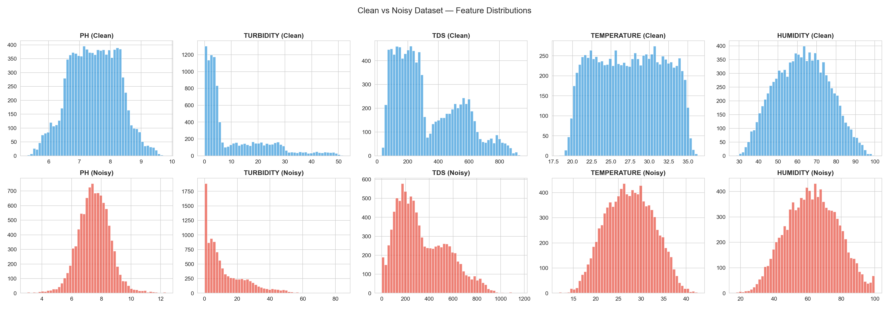

### 3.2 Statistics Comparison

| Statistic | Clean pH | Noisy pH | Clean TDS | Noisy TDS | Clean Turb | Noisy Turb |
|---|---|---|---|---|---|---|
| **Mean** | 7.473 | 7.517 | 329.8 | 336.7 | 10.46 | 12.41 |
| **Std** | 0.787 | **1.072** | 210.8 | **212.8** | 11.92 | **12.69** |
| **Min** | 5.310 | **3.013** | 29.6 | **0.0** | 0.0 | 0.0 |
| **Max** | 9.804 | **12.360** | 937.0 | **1167.2** | 51.75 | **84.70** |

Key differences: standard deviations increased by 15–36%, and min/max ranges expanded significantly due to spikes and drift.

### 3.3 Feature Distributions by Class (Noisy)

With noise, class boundaries overlap more, making classification harder.

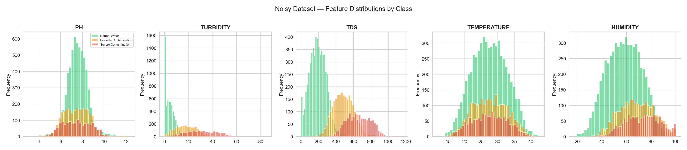

### 3.4 Correlation Degradation

Noise weakens inter-feature correlations that the models rely on for classification.

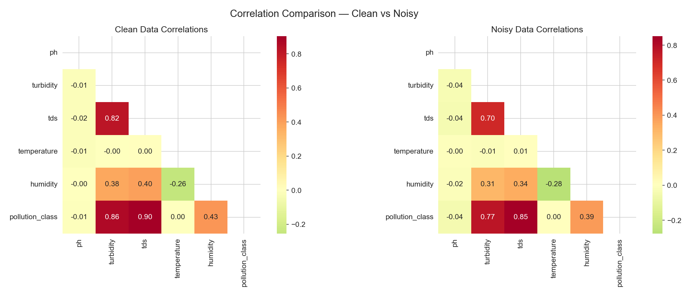

### 3.5 Box Plots (Noisy)

Wider interquartile ranges and more outliers are visible compared to the clean dataset.

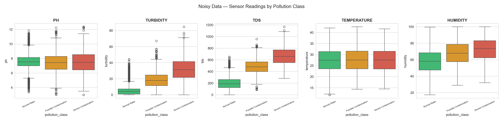

---

## 4. Isolation Forest — Noisy Results

### 4.1 Performance

| Metric | Clean | Noisy | Δ |
|---|---|---|---|
| **Accuracy** | 93.95% | 89.35% | **−4.9%** |
| **Precision** | 87.02% | — | — |
| **Recall** | 99.75% | — | — |
| **F1 Score** | 92.95% | 86.99% | **−6.0%** |

The Isolation Forest is more sensitive to noise because anomaly boundaries become less distinct when normal data itself has wider variance.

### 4.2 Anomaly Score Distribution

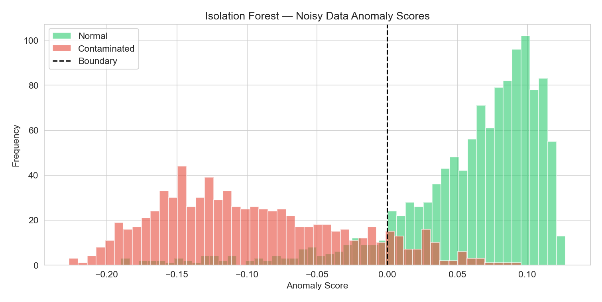

### 4.3 Confusion Matrix

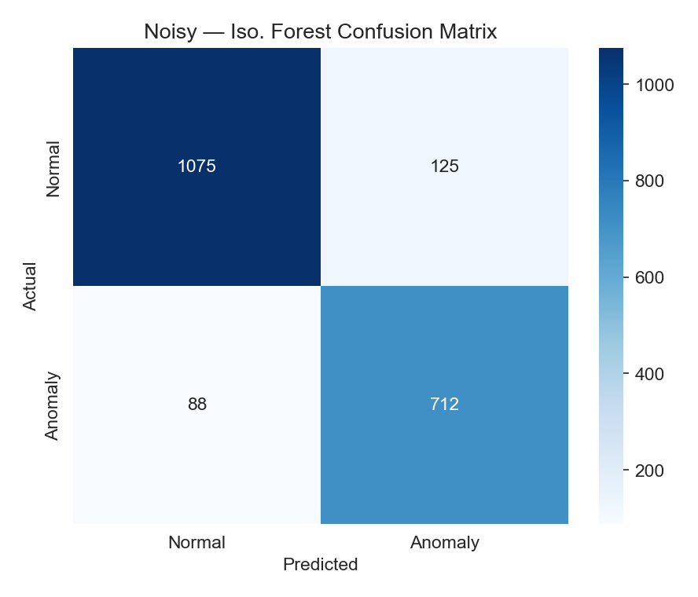

### 4.4 PCA Projection

More overlap between normal and anomaly clusters in PCA space under noisy conditions.

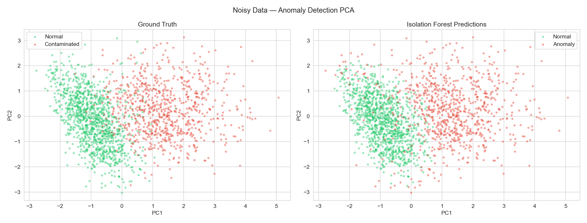

---

## 5. K-Means Clustering — Noisy Results

### 5.1 Elbow & Silhouette (Noisy)

The elbow is less pronounced with noise, indicating weaker cluster separation.

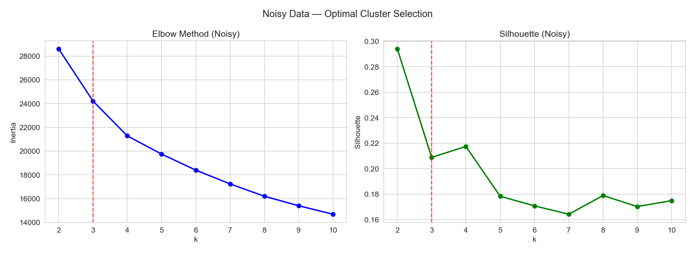

### 5.2 Cluster Visualization

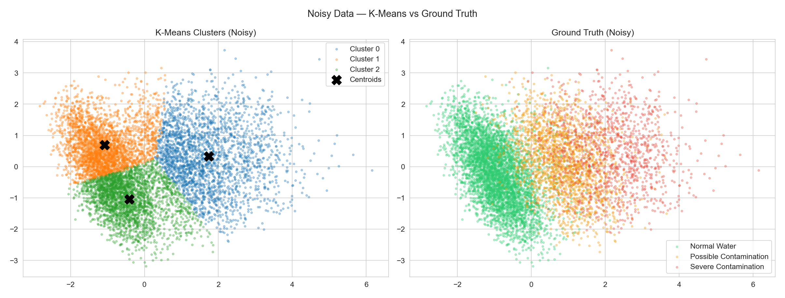

### 5.3 Cluster Centroids (Noisy)

| Cluster | pH | Turbidity | TDS | Temp | Humidity | Interpretation |
|---|---|---|---|---|---|---|
| 0 | 7.41 | 27.14 | 591.42 | 27.56 | 71.94 | **Contaminated** |
| 1 | 7.55 | 5.90 | 226.92 | 31.52 | 51.37 | Normal (warm) |
| 2 | 7.63 | 5.97 | 227.16 | 23.39 | 66.94 | Normal (cool) |

### 5.4 Mapped Accuracy

| Condition | K-Means Accuracy |
|---|---|
| Clean | 78.45% |
| Noisy | 75.20% (**−4.1%**) |

---

## 6. Neural Network — Noisy Results

### 6.1 Training Curves

Noisier data leads to slightly lower convergence ceiling and more validation fluctuation.

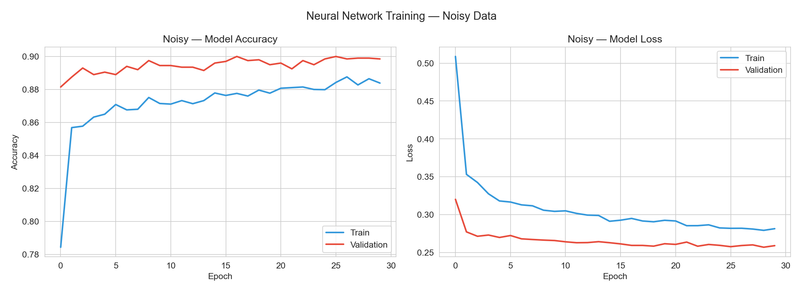

### 6.2 Performance

| Metric | Clean | Noisy | Δ |
|---|---|---|---|
| **Accuracy** | 95.20% | 89.85% | **−5.6%** |
| **Precision** | 95.68% | 90.02% | **−5.7%** |
| **Recall** | 95.20% | 89.85% | **−5.4%** |
| **F1 Score** | 95.01% | 89.72% | **−5.3%** |

### 6.3 Per-Class Performance (Noisy)

| Class | Precision | Recall | F1 Score |
|---|---|---|---|
| Normal Water | 96.53% | 97.42% | 96.97% |
| Possible Contamination | 77.03% | 85.20% | 80.91% |
| Severe Contamination | 85.59% | 67.33% | 75.37% |

Severe Contamination recall drops from 71.0% (clean) to 67.3% (noisy) — the hardest class to detect under noisy conditions.

### 6.4 Confusion Matrix

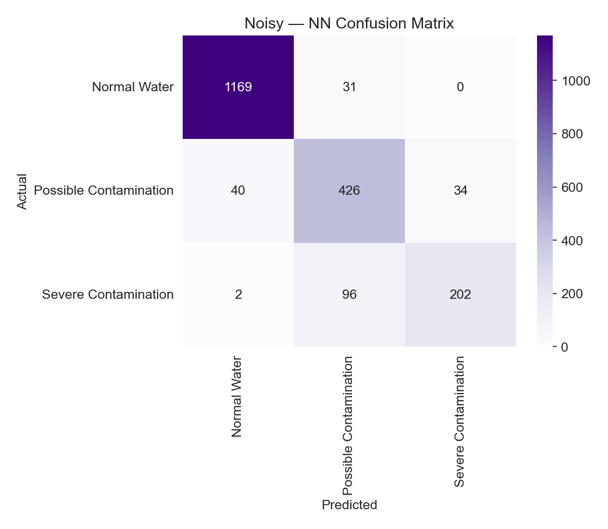

### 6.5 ROC Curves

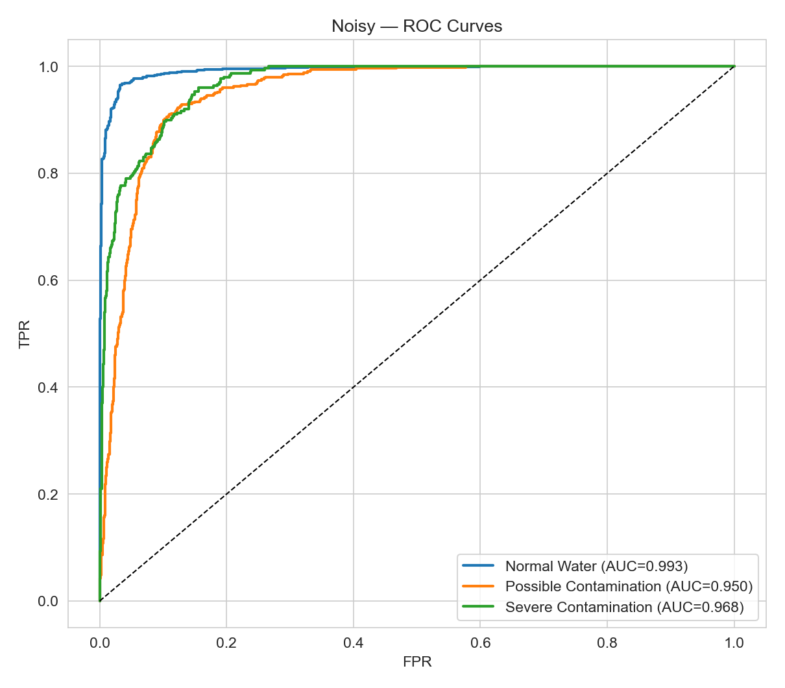

### 6.6 Precision-Recall Curves

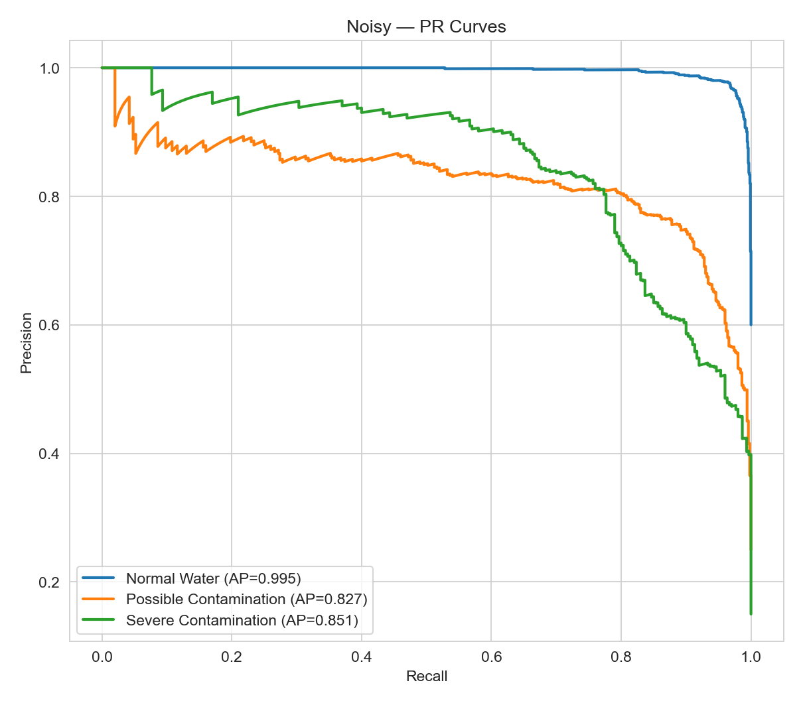

### 6.7 Feature Importance (Noisy)

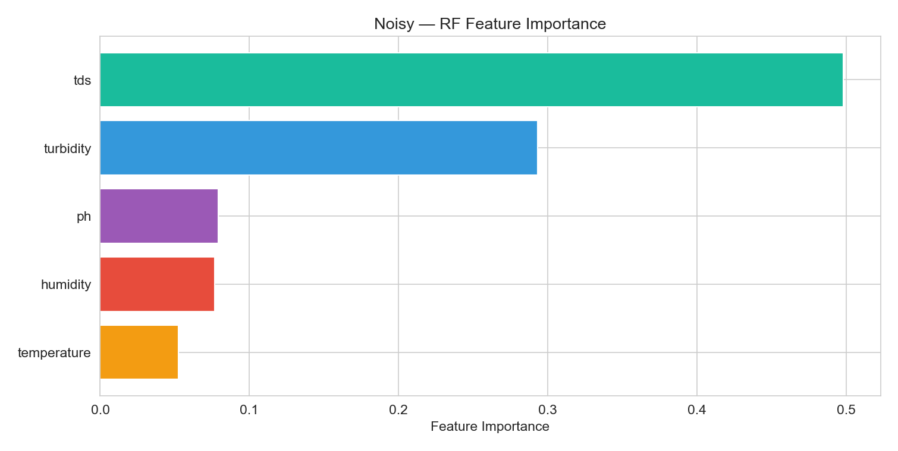

---

## 7. Cross-Comparison — Controlled vs Uncontrolled

### 7.1 Accuracy Comparison

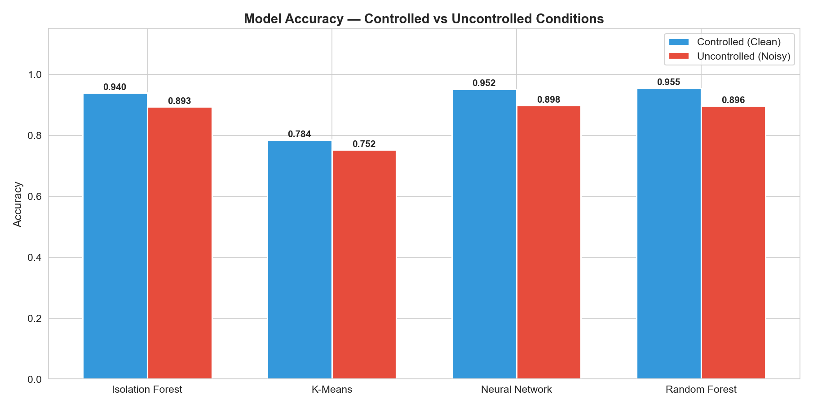

### 7.2 F1 Score Comparison

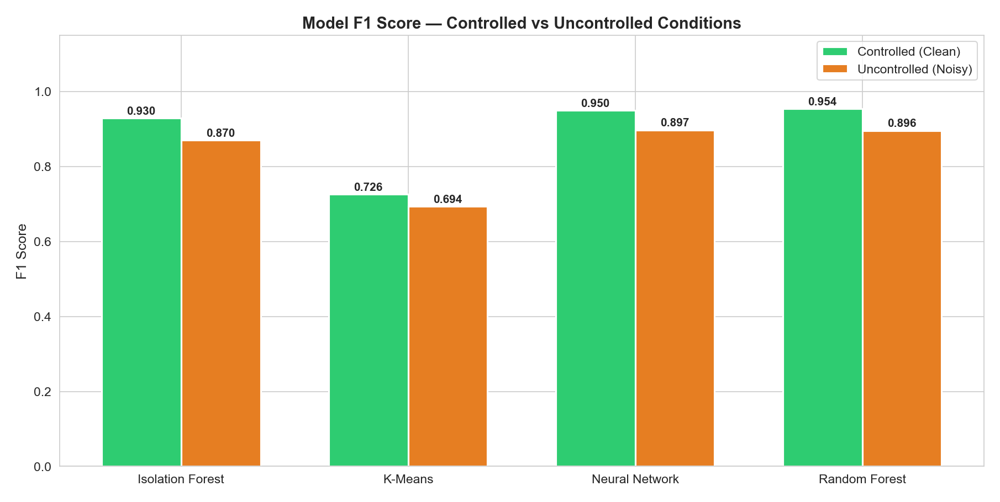

### 7.3 Performance Degradation

The performance drop bar chart shows all models degrade by 4–6%, with Random Forest and Neural Network being most affected.

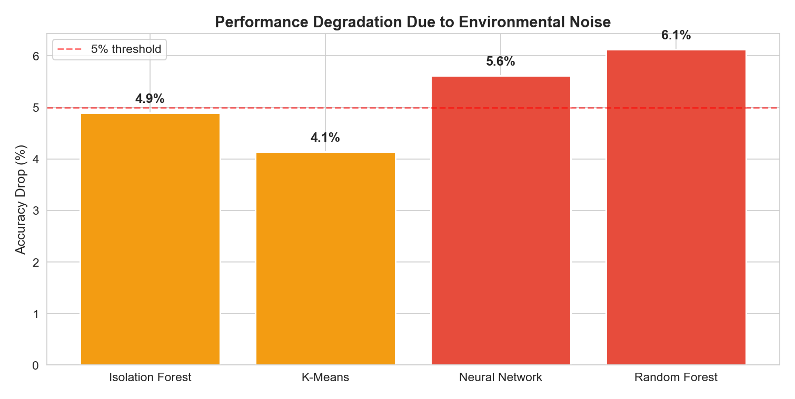

### 7.4 Radar Chart — NN Clean vs Noisy

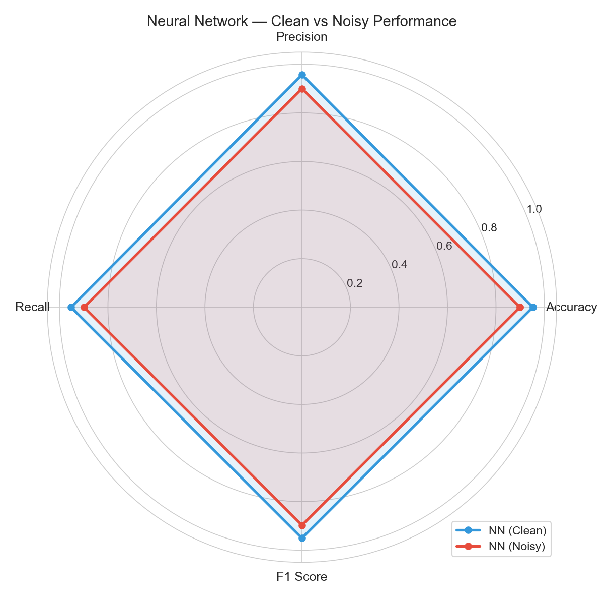

### 7.5 Per-Class F1 Comparison

Severe Contamination suffers the largest drop, while Normal Water remains robust.

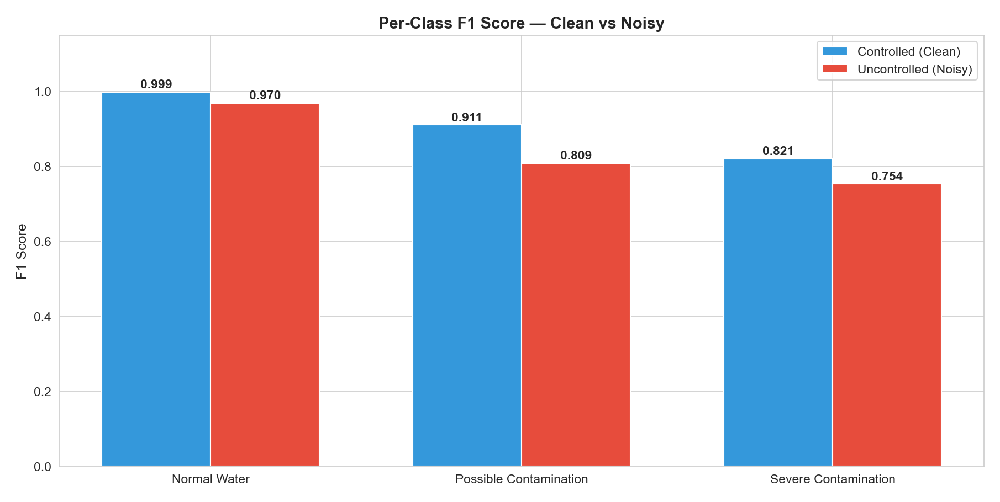

### 7.6 Class Separability — PCA

The clean dataset shows tight, well-separated clusters. The noisy dataset shows significant spread and boundary overlap.

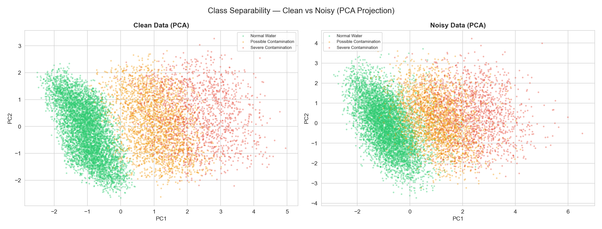

---

## 8. Comprehensive Comparison Table

| Model | Clean Accuracy | Noisy Accuracy | Drop | Clean F1 | Noisy F1 | Drop |
|---|---|---|---|---|---|---|
| **Isolation Forest** | 93.95% | 89.35% | **4.9%** | 92.95% | 86.99% | **6.4%** |
| **K-Means** | 78.45% | 75.20% | **4.1%** | 72.62% | 69.39% | **4.4%** |
| **Neural Network** | 95.20% | 89.85% | **5.6%** | 95.01% | 89.72% | **5.6%** |
| **Random Forest** | 95.50% | 89.65% | **6.1%** | 95.39% | 89.60% | **6.1%** |

### Key Takeaways

1. **All models degrade by 4–6%** under uncontrolled conditions, but **none collapse catastrophically** — the proxy sensing approach is fundamentally robust.

2. **K-Means is the most noise-resistant** (4.1% drop) because unsupervised clustering naturally adapts to data spread. However, its baseline accuracy is already the lowest.

3. **Random Forest degrades the most** (6.1%) because tree-based decisions make hard splits that are sensitive to noisy feature boundaries.

4. **Normal Water classification remains strong** (~97% F1 even with noise) — the system reliably identifies safe water.

5. **Severe Contamination is the hardest class** under noise, with F1 dropping from 82.08% to 75.37% — more training data or sensor calibration would help.

6. **For deployment**, the system should use the Neural Network for classification plus the Isolation Forest as a safety pre-filter, and include periodic sensor recalibration to minimize drift effects.

---

*Generated by the Smart Wastewater Monitoring System — "The Jellyfish" 🪼*
