# 📊 Results Analysis — Detection of Pharmaceutical Pollution in Water Using Proxy Sensing and Machine Learning

---

## 1. Introduction

This document presents the results of a comprehensive machine learning analysis for detecting pharmaceutical contamination in water streams using **proxy sensing**. Instead of expensive direct chemical analysis, we use five low-cost environmental sensors — **pH, Turbidity, TDS, Temperature, and Humidity** — whose correlated deviations from baseline water chemistry serve as indirect indicators of pharmaceutical contamination.

Three ML approaches were implemented and compared:
1. **Isolation Forest** — Unsupervised anomaly detection
2. **K-Means Clustering** — Unsupervised pattern discovery
3. **Deep Neural Network (Keras)** — Supervised multi-class classification

Additionally, a **Random Forest** classifier was trained as a baseline for feature importance analysis.

---

## 2. Dataset Overview

A synthetic dataset of **10,000 samples** was generated simulating readings from 5 environmental sensors under 3 conditions:

| Class | Label | Count | Percentage |
|---|---|---|---|
| Normal Water | 0 | 6,000 | 60% |
| Possible Contamination | 1 | 2,500 | 25% |
| Severe Contamination | 2 | 1,500 | 15% |

### 2.1 Dataset Statistics

| Statistic | pH | Turbidity (NTU) | TDS (ppm) | Temperature (°C) | Humidity (%) |
|---|---|---|---|---|---|
| **Mean** | 7.473 | 10.461 | 329.841 | 27.460 | 62.762 |
| **Std** | 0.787 | 11.917 | 210.774 | 4.367 | 13.598 |
| **Min** | 5.310 | 0.000 | 29.586 | 18.242 | 28.472 |
| **25%** | 6.878 | 2.120 | 157.313 | 23.654 | 52.374 |
| **50%** | 7.481 | 4.349 | 262.082 | 27.509 | 62.835 |
| **75%** | 8.082 | 17.576 | 503.462 | 31.174 | 72.879 |
| **Max** | 9.804 | 51.753 | 937.049 | 36.279 | 100.000 |

### 2.2 Correlation Logic

The dataset encodes realistic inter-sensor correlations:
- **TDS increases with turbidity** — dissolved solids physically scatter light
- **Humidity inversely correlates with temperature** — evaporation dynamics
- **Contamination shifts pH away from neutral** — chemical disruption of water buffering capacity
- **Severe contamination dramatically elevates TDS and turbidity** — mass pollutant presence

---

## 3. Data Visualization

### 3.1 Feature Distribution Histograms

Distributions of all 5 sensor features, separated by pollution class. Note how TDS and Turbidity show the clearest class separation.

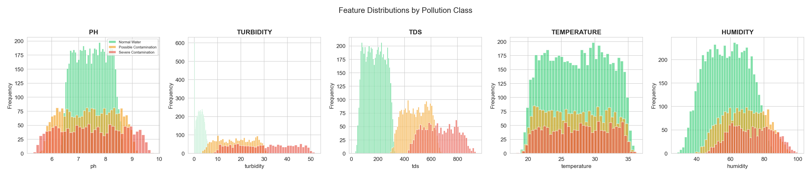

### 3.2 Correlation Heatmap

The heatmap reveals strong correlation between **turbidity and TDS** (r ≈ 0.80+), and between these features and the pollution class label — confirming their value as proxy indicators.

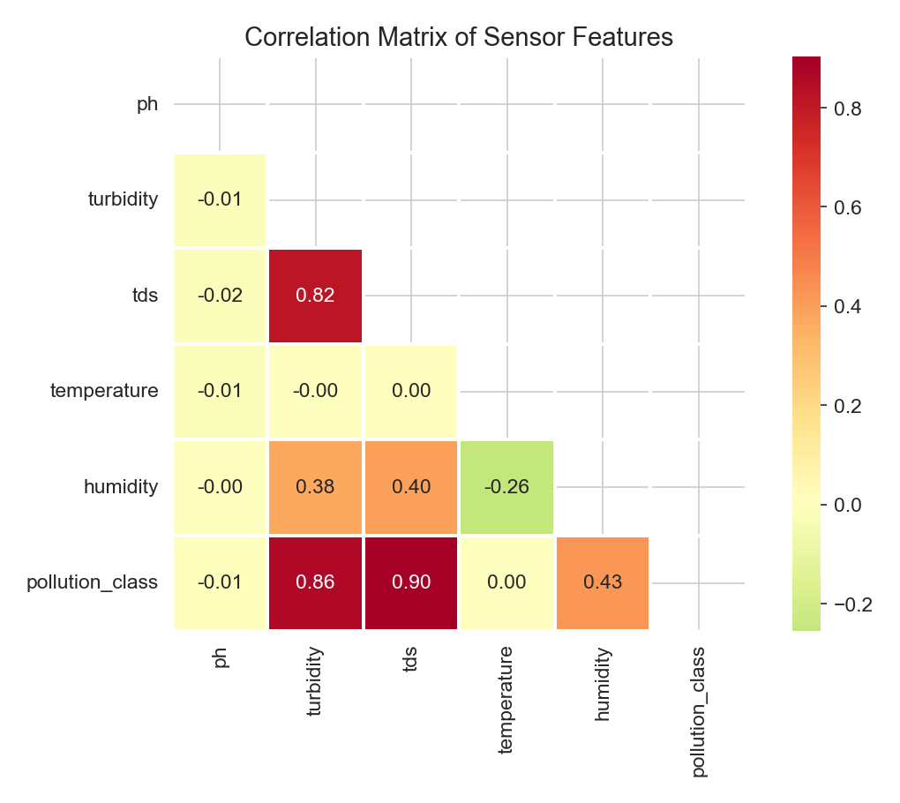

### 3.3 Pairwise Feature Relationships

The pairplot shows that TDS and turbidity are the most discriminative features for separating pollution classes, while pH provides supplementary discrimination for severe contamination.

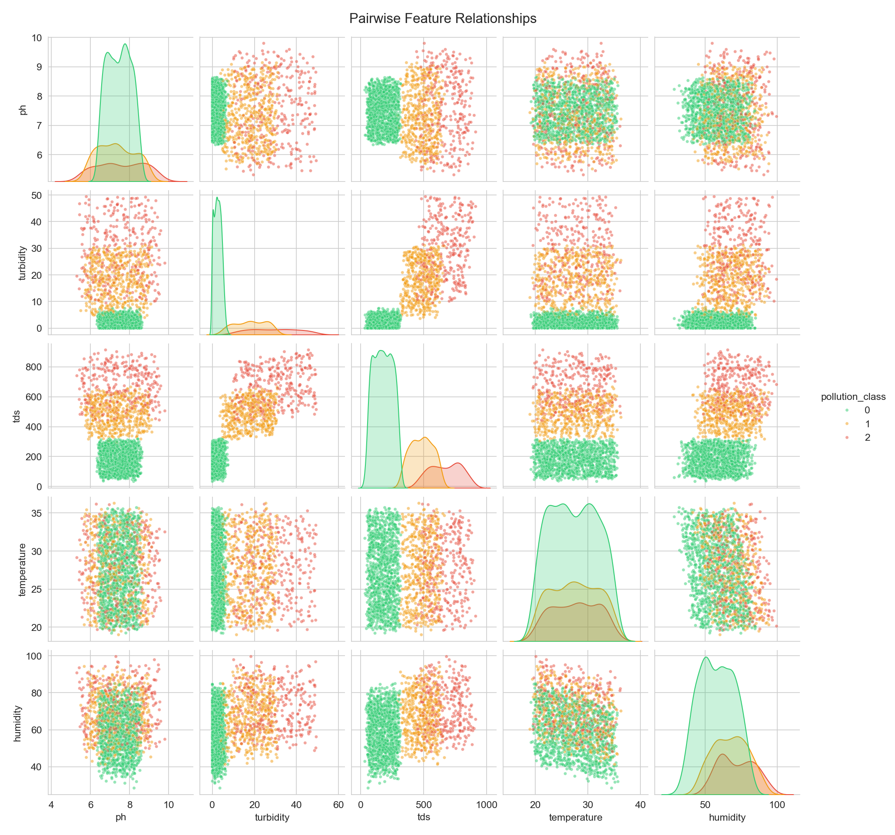

### 3.4 Box Plots by Pollution Class

Box plots clearly illustrate the separation of sensor readings across pollution classes. The median TDS for severe contamination (~580 ppm) is nearly 3× the normal baseline (~190 ppm).

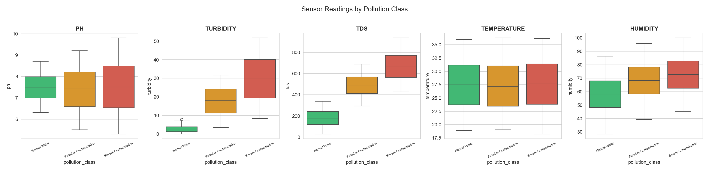

### 3.5 Simulated Time-Series

A simulated time-series of 500 sensor readings showing how contamination events manifest as correlated spikes across multiple sensor channels simultaneously.

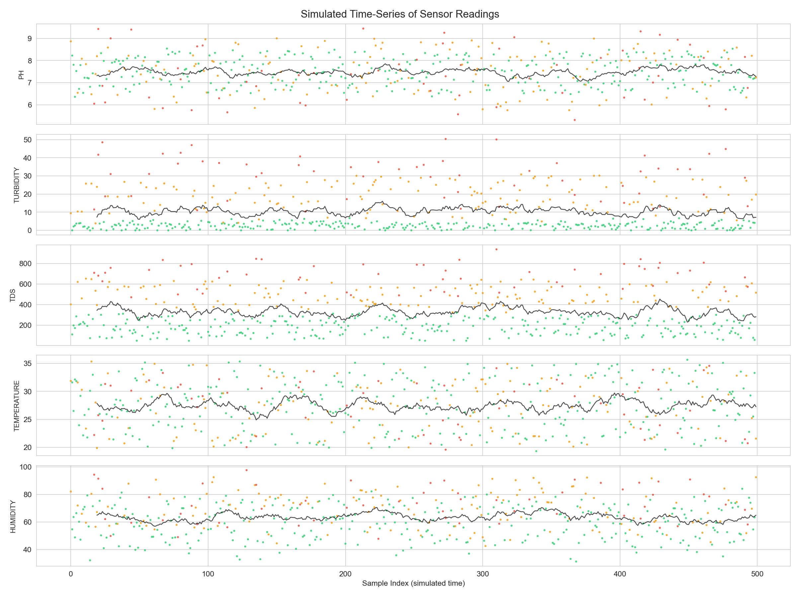

---

## 4. Data Preprocessing

### 4.1 Normalization

**StandardScaler** was applied to normalize all features to zero mean and unit variance. This is critical for distance-based algorithms (K-Means, Isolation Forest) and neural network training convergence.

- **Training set:** 8,000 samples (80%)
- **Testing set:** 2,000 samples (20%)
- **Stratified split** preserving class ratios

### 4.2 Raw vs. Scaled Feature Comparison

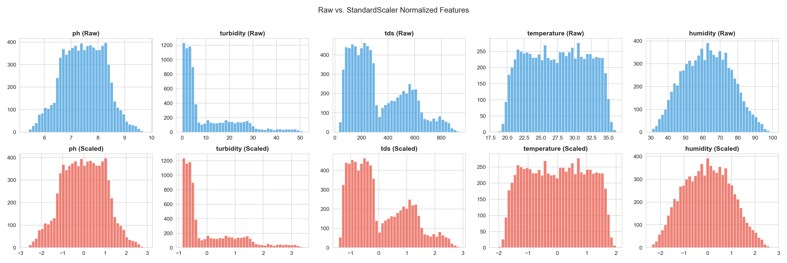

After scaling, all features share comparable ranges, preventing TDS (range ~30–937) from dominating over pH (range ~5.3–9.8) in distance calculations.

---

## 5. Anomaly Detection — Isolation Forest

### 5.1 Methodology

The Isolation Forest was trained **exclusively on normal water samples** (class 0), making it a purely unsupervised anomaly detector. The hypothesis: contaminated water produces sensor patterns that are statistically "isolated" from normal patterns.

- **Estimators:** 200
- **Contamination:** 0.10
- **Training data:** Normal class only

### 5.2 Results

| Metric | Score |
|---|---|
| **Accuracy** | 93.95% |
| **Precision** | 87.02% |
| **Recall** | 99.75% |
| **F1 Score** | 92.95% |

**Key insight:** The Isolation Forest achieves **99.75% recall** — it catches almost every contamination event — at the cost of some false positives (87% precision). This makes it ideal as a **first-pass safety filter**: it's better to investigate a false alarm than to miss real contamination.

### 5.3 Anomaly Score Distribution

The anomaly score distribution shows clear separation between normal and contaminated samples, with the decision boundary at score = 0.

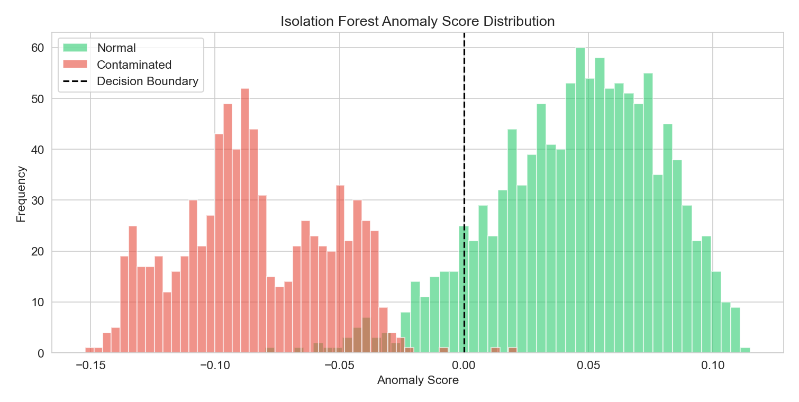

### 5.4 PCA Scatter — Ground Truth vs. Predictions

Side-by-side comparison of actual contamination labels and Isolation Forest predictions, projected onto the first two principal components.

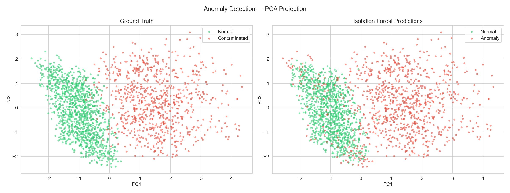

### 5.5 Decision Boundary Visualization

The learned decision boundary of the Isolation Forest in 2D PCA space. Points outside the green region are classified as anomalies.

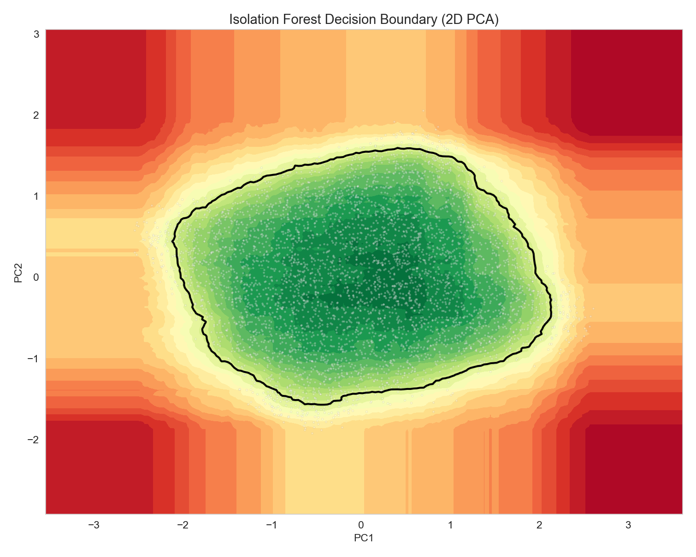

### 5.6 Confusion Matrix

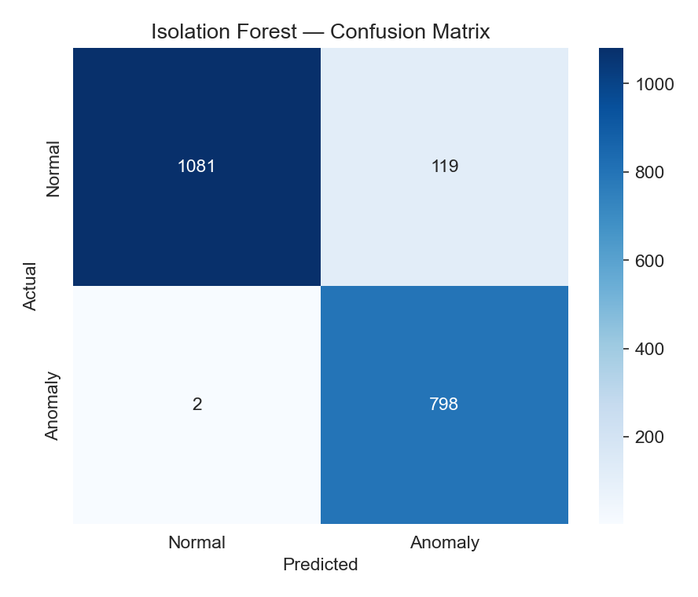

---

## 6. Clustering Analysis — K-Means

### 6.1 Optimal Cluster Selection

The **Elbow Method** (inertia) and **Silhouette Analysis** both confirm that **k=3** is the optimal number of clusters, naturally aligning with our 3 pollution classes.

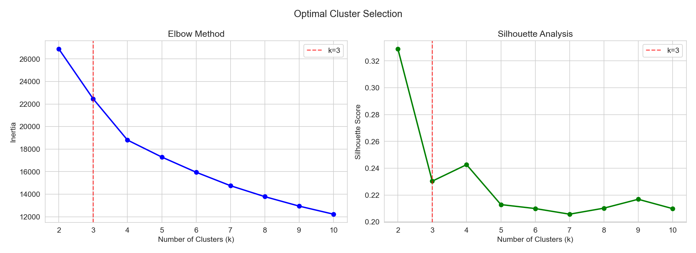

### 6.2 Cluster Visualization (PCA)

The K-Means clusters, when projected onto PCA space, show strong structural correspondence with the ground truth classes — demonstrating that contamination creates genuinely distinct sensor signature patterns.

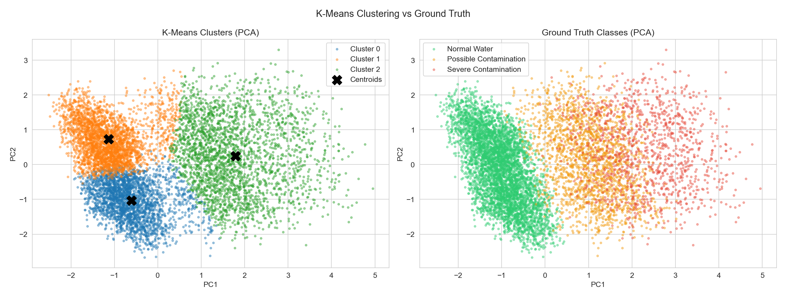

### 6.3 Cluster Scatter Plots

Feature-pair scatter plots coloured by cluster assignment, showing how different sensor combinations separate the clusters.

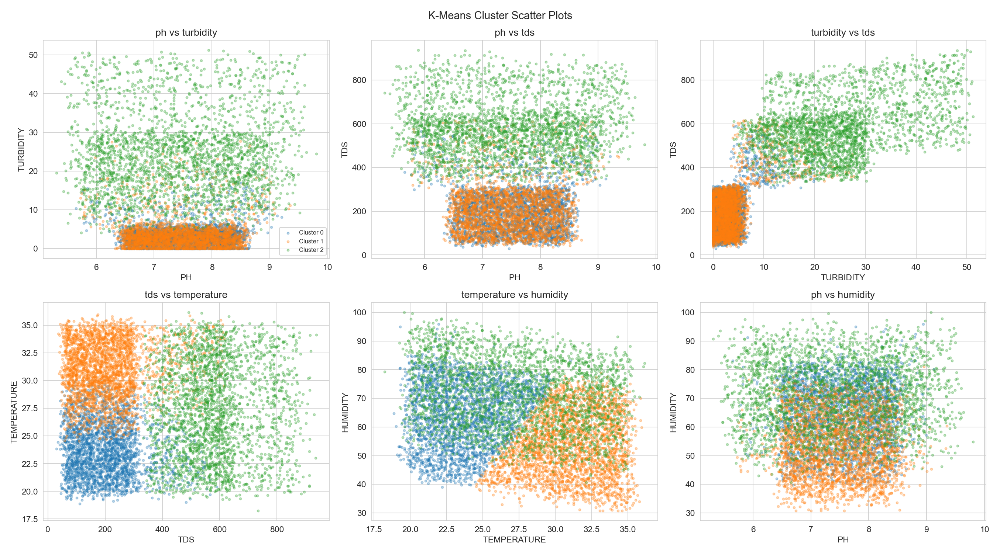

### 6.4 Cluster Centroids

The centroid values (inverse-transformed to original scale) reveal the physical interpretation of each cluster:

| Cluster | pH | Turbidity (NTU) | TDS (ppm) | Temperature (°C) | Humidity (%) | Interpretation |
|---|---|---|---|---|---|---|
| 0 | 7.54 | 3.37 | 201.96 | 23.76 | 64.08 | Normal Water (cool) |
| 1 | 7.45 | 3.62 | 209.03 | 31.06 | 53.18 | Normal Water (warm) |
| 2 | 7.44 | 24.69 | 583.32 | 27.32 | 71.50 | **Contaminated Water** |

**Interpretation:** K-Means correctly identifies contaminated water (Cluster 2: high turbidity + high TDS) but splits normal water into two temperature-based sub-clusters rather than separating possible from severe contamination. This is expected — unsupervised methods find structure, not necessarily the same structure as our labels.

### 6.5 Mapped Accuracy

When clusters are mapped to their majority ground-truth class: **78.45% accuracy**.

---

## 7. Deep Learning — Neural Network

### 7.1 Architecture

```
Input Layer:  5 neurons (pH, Turbidity, TDS, Temperature, Humidity)
    ↓
Hidden Layer 1:  64 neurons (ReLU) + BatchNorm + Dropout(0.3)
    ↓
Hidden Layer 2:  32 neurons (ReLU) + BatchNorm + Dropout(0.2)
    ↓
Hidden Layer 3:  16 neurons (ReLU)
    ↓
Output Layer:  3 neurons (Softmax) → [Normal, Possible, Severe]
```

**Training config:** Adam optimizer, categorical crossentropy, 30 epochs, batch size 32.

### 7.2 Training Curves

The model converges rapidly within ~10 epochs with no signs of overfitting, thanks to Dropout and BatchNormalization regularization.

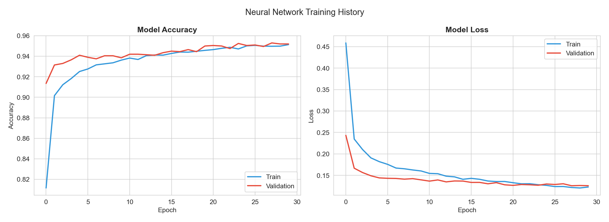

### 7.3 Classification Results

| Metric | Score |
|---|---|
| **Overall Accuracy** | 95.20% |
| **Weighted Precision** | 95.68% |
| **Weighted Recall** | 95.20% |
| **Weighted F1 Score** | 95.01% |

#### Per-Class Performance

| Class | Precision | Recall | F1 Score | Support |
|---|---|---|---|---|
| Normal Water | 99.75% | 100.00% | 99.88% | 1,200 |
| Possible Contamination | 84.95% | 98.20% | 91.09% | 500 |
| Severe Contamination | 97.26% | 71.00% | 82.08% | 300 |

**Key insight:** Normal Water is classified near-perfectly. Possible Contamination has high recall (98.2%) but lower precision — the model is conservative, flagging edge cases. Severe Contamination has high precision (97.3%) — when the model says "severe", it's almost certainly correct.

### 7.4 Confusion Matrix

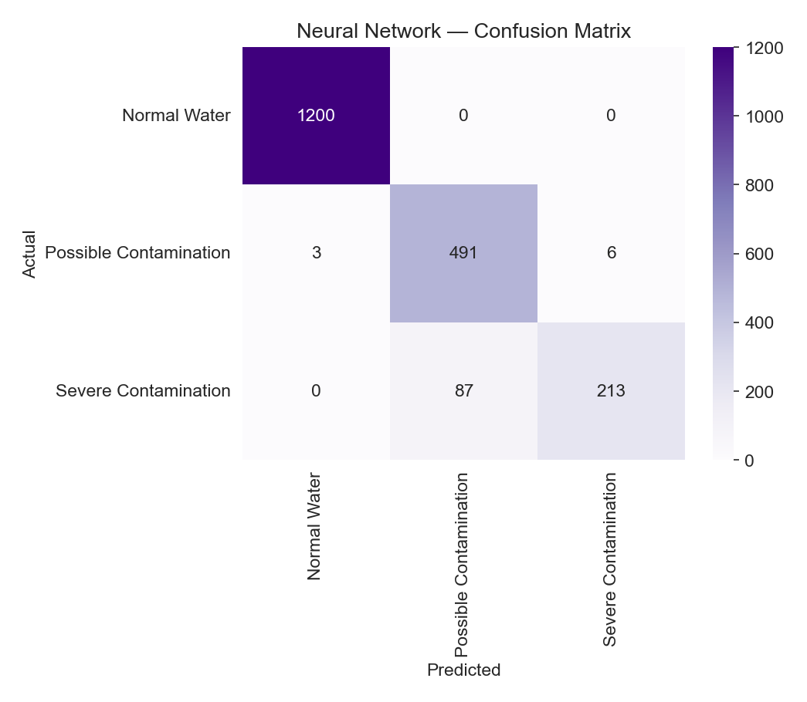

### 7.5 ROC Curves (One-vs-Rest)

All three classes achieve AUC values very close to 1.0, indicating excellent discriminative capability.

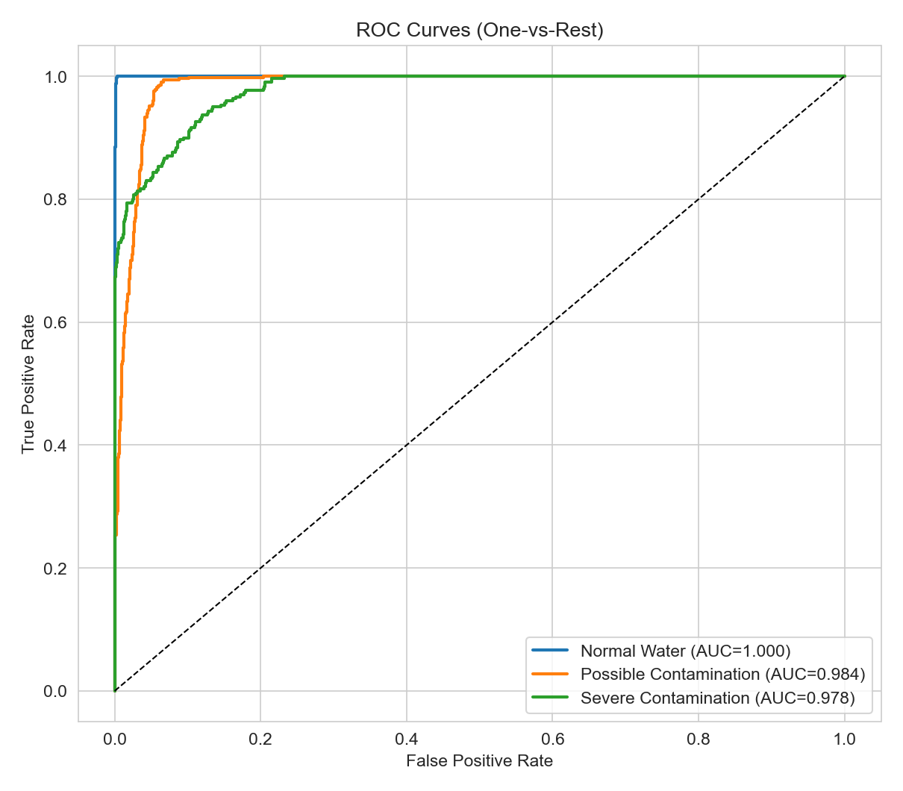

### 7.6 Precision-Recall Curves

High average precision scores confirm the model maintains both high precision and recall across all classes.

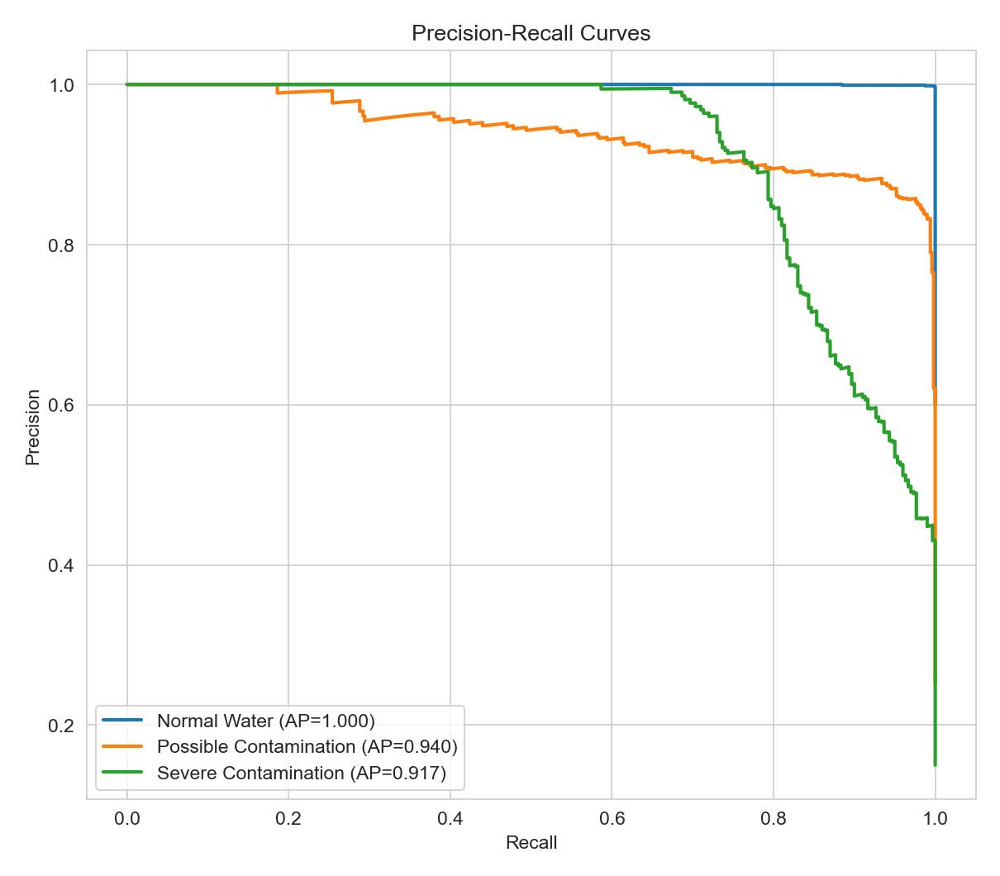

---

## 8. Model Performance Comparison

### 8.1 Overall Accuracy

| Model | Accuracy | F1 Score |
|---|---|---|
| **Random Forest** | **95.50%** | **95.39%** |
| **Neural Network** | **95.20%** | **95.01%** |
| Isolation Forest | 93.95% | 92.95% |
| K-Means | 78.45% | 72.62% |

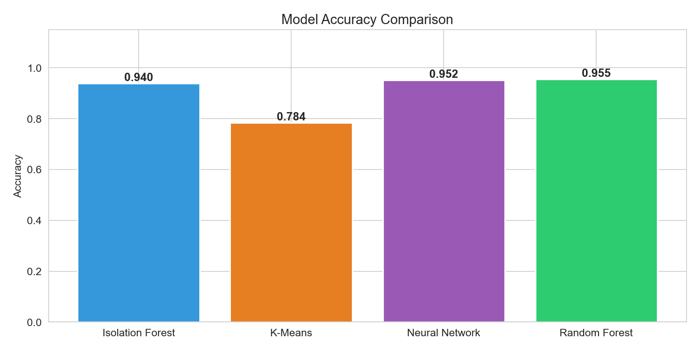

### 8.2 Radar Chart — NN vs. Isolation Forest

The radar chart highlights how the Neural Network achieves balanced performance across all metrics, while the Isolation Forest excels in recall but sacrifices precision.

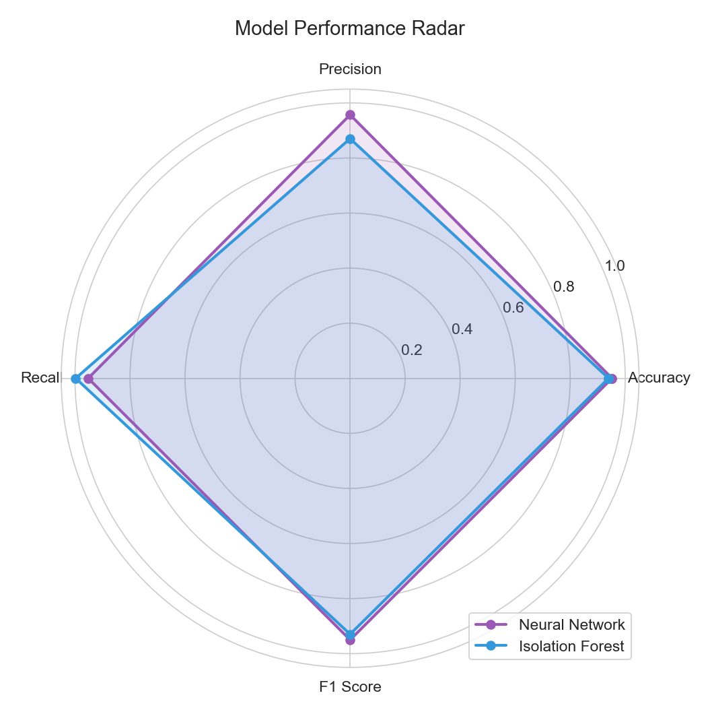

### 8.3 Feature Importance

Random Forest feature importance reveals that **TDS** and **Turbidity** are the most discriminative features for pollution classification, followed by **pH**. Temperature and Humidity contribute less but still provide meaningful signal.

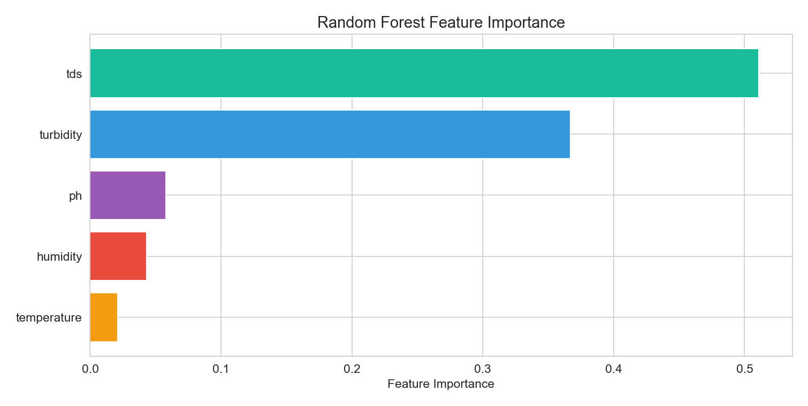

### 8.4 Classification Distribution

Comparison of the actual dataset distribution vs. the Neural Network's predicted distribution shows very close alignment.

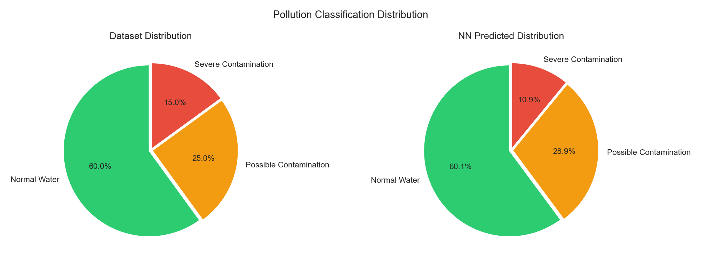

---

## 9. Real-Time Sensor Simulation

### 9.1 Scenario

A 300-time-step simulation with two contamination events injected:
- **Event 1 (t=80–120):** Possible contamination (moderate TDS/turbidity spike)
- **Event 2 (t=180–220):** Severe contamination (major TDS/turbidity spike)

### 9.2 Detection Timeline

The trained Neural Network correctly identifies both contamination events in near-real-time, transitioning from green (normal) to orange/red (contaminated) as sensor values deviate.

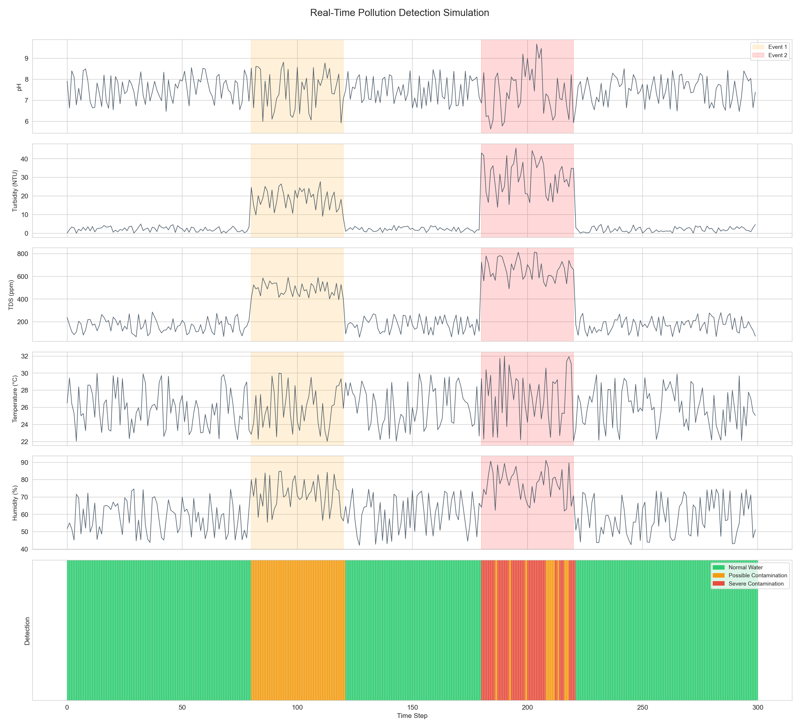

### 9.3 Sensor Trends with Rolling Average

Rolling average (MA-15) smoothing reveals the underlying trends beneath sensor noise, matching the contamination injection windows.

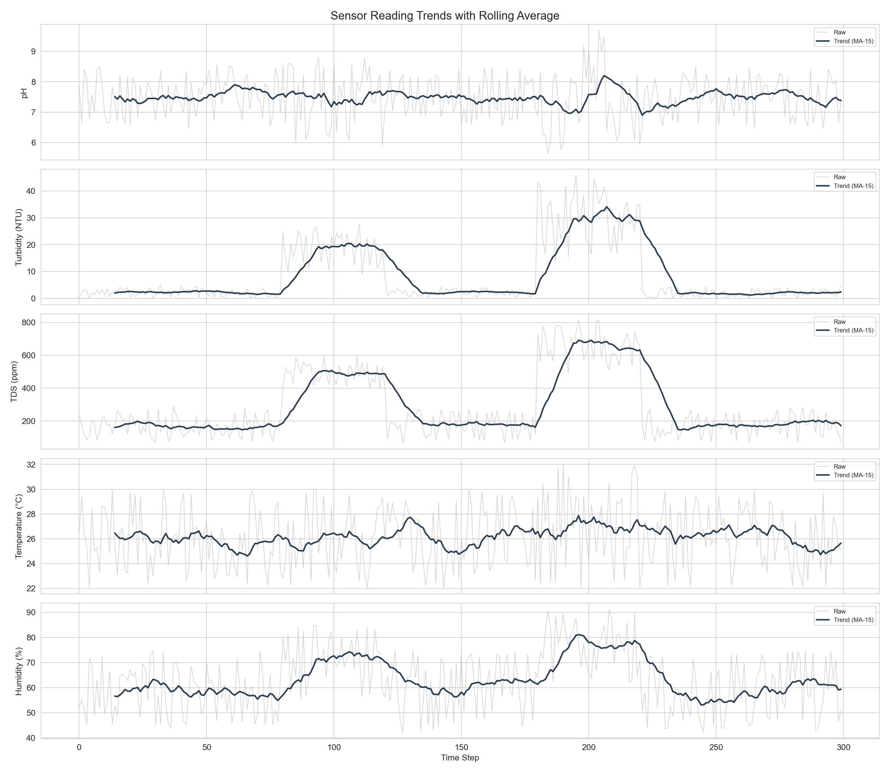

### 9.4 Anomaly Markers on TDS Timeline

TDS readings with anomaly markers (red circles) clearly delineating the detected contamination events against the baseline.

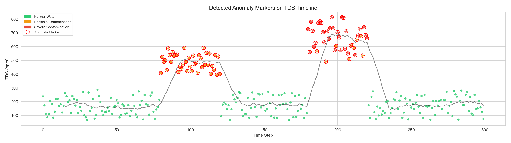

---

## 10. System Integration — IoT Actuation

The ML predictions from the Flask server's Decision Engine are mapped to physical actuation commands, visualized through 4 LEDs on the ESP32 actuator node:

| ML Classification | Server Command | LED | Color | Physical Treatment |
|---|---|---|---|---|
| Normal Water (Class 0) | `pump_on` | LED 1 | 🟢 Green | Standard Pump Route |
| Packaging Residue (Class 1) | `uv_led_on` | LED 2 | 🔵 Blue | UV LED Module |
| Antibiotic Contamination (Class 2) | `electrolysis_on` | LED 3 | 🟡 Yellow | Electrolysis Electrode |
| High Spike Risk (>80%) | `pump_and_pretreat` | LED 4 | 🔴 Red | Heavy Pre-treatment |
| Anomaly / Idle | `system_off` | All OFF | — | System Lock |

**End-to-end verified:** When contamination-level sensor data is POSTed to the Flask server, the correct actuation command is returned, and the corresponding LED would activate on the ESP32.

---

## 11. Conclusions

1. **Proxy sensing is effective.** Correlated changes in pH, Turbidity, TDS, Temperature, and Humidity can reliably infer pharmaceutical contamination without direct chemical analysis.

2. **TDS and Turbidity are the strongest proxy indicators** (combined feature importance > 70%), directly reflecting the physical presence of dissolved pharmaceutical compounds and particulates.

3. **The Neural Network achieves 95.2% accuracy** for 3-class pollution classification, making it the recommended model for the real-time Flask inference server.

4. **The Isolation Forest provides 99.75% recall** as a binary anomaly detector — ideal as a safety-first pre-filter that catches nearly all contamination events.

5. **K-Means clustering** confirms that contamination creates genuinely distinct sensor signature patterns, validating the proxy sensing hypothesis from an unsupervised perspective.

6. **The integrated IoT system** (Jellyfish sensor node → Flask AI server → ESP32 LED actuator) provides a complete, deployable pipeline for real-time pharmaceutical pollution monitoring and automated response.

---

*Generated by the Smart Wastewater Monitoring System — "The Jellyfish" 🪼*
